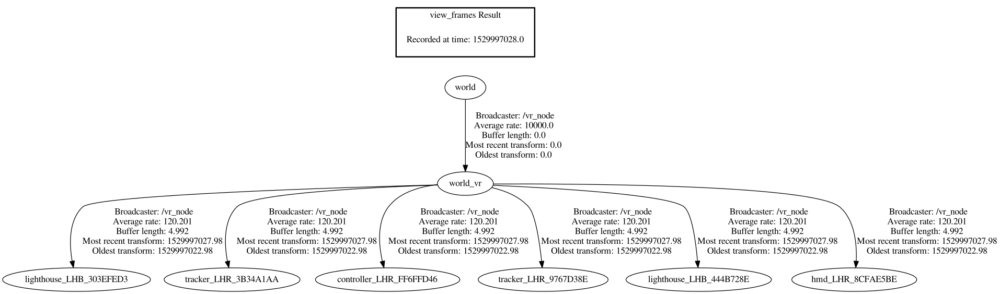
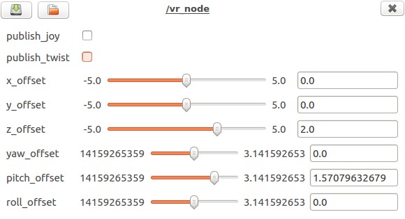

# vr_ros

vr_ros is a Robotic Operating System (ROS) package that utilises the [OpenVR SDK](https://github.com/ValveSoftware/openvr) by Valve, to make VR devices such as the HTC VIVE available in a ROS environment. The package is loosely based on an existing [vive_ros](https://github.com/robosavvy/vive_ros) package by RoboSavvy, and it exposes a lot of the same functionality. The essentials of the [OpenVR SDK](https://github.com/ValveSoftware/openvr) is explained in great detail in the [OpenVR Quick Start](https://github.com/osudrl/CassieVrControls/wiki/OpenVR-Quick-Start) guide by Kevin Kellar. The guide is also saved locally in this package under the ```doc/CassieVrControls.wiki``` folder.


## Features

The package supports the following types of devices:
* HMD (Head-Mounted Display)
* Controller
* Tracker
* Lighthouse

The package exposes the position and orientation (pose) of each device as coordinate frames relative to the *world_vr* frame in the tf tree, which is configurable relative to the *world* frame. The naming scheme of each coordinate frame follows the following structure: &lt;device type&gt;_&lt;serial number&gt;, e.g. *controller_LHR_FF6FFD46*. The serial number is used both internally and externally (in the package) to uniquely identify tracked devices. This results in a structure similar to the tf tree example that is shown below:



The package can also publishes the linear and angular velocities (twists) of tracked devices as a geometry_msgs/TwistStamped message on the */vr/twist/&lt;device type&gt;_&lt;serial number&gt;* topic, e.g. */vr/twist/controller_LHR_FF6FFD46*. Axes and buttons on controllers can also be published as a sensor_msgs/Joy message on the */vr/joy/&lt;device type&gt;_&lt;serial number&gt;* topic, e.g. */vr/joy/controller_LHR_FF6FFD46*. Joy messages are only published when the controllers are interacted with. These publishers are not enabled by default, but they are easily enabled during runtime by using the [rqt_reconfigure](http://wiki.ros.org/rqt_reconfigure) package.

## Requirements

### OpenVR SDK

The package requires the [OpenVR SDK](https://github.com/ValveSoftware/openvr), which has to be built from the newest available source. It is possible to download and build the source in the correct folder by utilising the following commands:
```
cd ~
mkdir lib
cd lib
git clone https://github.com/ValveSoftware/openvr.git
cd openvr
mkdir build
cd build
cmake -DCMAKE_BUILD_TYPE=Release ../
make
```

It is also possible to specify which folder the [OpenVR SDK](https://github.com/ValveSoftware/openvr) should be located in, by changing the *CMakeLists.txt* file in the package directory:
```
set(OPENVR "$ENV{HOME}/lib/openvr")
```

### Steam and SteamVR

SteamVR is available through [Steam](https://store.steampowered.com/about/), which is utilised for configuration and room setup. It is also required for running this package by itself, as it depends on the *vrserver* process running in the background. This is a requirement because the OpenVR part of the package runs as a background application ([OpenVR API Documentation](https://github.com/ValveSoftware/openvr/wiki/API-Documentation)):

```VRApplication_Background``` - The application will not start SteamVR. If it is not already running the call with VR_Init will fail with VRInitError_Init_NoServerForBackgroundApp.

[Steam](https://store.steampowered.com/about/) is installed by following the *Getting Started* guide on their [Steam for Linux](https://github.com/ValveSoftware/steam-for-linux) tracker. SteamVR should be installed automatically by Steam if there is any VR devices present on your computer. It is also important to meet the **GRAPHICS DRIVER REQUIREMENTS** and the **USB DEVICE REQUIREMENTS** on their [SteamVR for Linux](https://github.com/ValveSoftware/SteamVR-for-Linux) tracker. A complete guide on getting the HTC VIVE up and running in SteamVR is available from: [HTC Vive Installation Guide](https://support.steampowered.com/steamvr/HTC_Vive/).

## Installation

The package is built by cloning this repository into your catkin workspace (catkin_ws/src directory) and then making it with ```catkin_make```

## Usage

The package is simply run by launching the following launch file:
```roslaunch vr_ros vr.launch```

*You may have to change the directory paths for Steam and your Catkin workspace in the ```/scripts/launch.sh``` shell script depending on their location. The package assumes that the directories are in their defuault locations.*

```
STEAM_RUNTIME=$HOME/.steam/steam/ubuntu12_32/steam-runtime
CATKIN_WS=$HOME/catkin_ws
```

## Configuration



The position and orientation (pose) of each device is defined relative to the *world_vr* frame, which has the same position as one of the lighthouses. This frame has to be defined relative to some defined *world* frame to make sense of the environment. The transformation between these frames are exposed as x-, y-, z-, yaw-, pitch-, roll-offset parameters by the [dynamic_reconfigure](http://wiki.ros.org/dynamic_reconfigure) package. This package provides a standard way to change the offset parameters at any time without having to restart the node, and also provides a graphical user interface (GUI) to change these parameters by using [rqt_reconfigure](http://wiki.ros.org/rqt_reconfigure):

```rosrun rqt_reconfigure rqt_reconfigure```.

The parameters from [dynamic_reconfigure](http://wiki.ros.org/dynamic_reconfigure) are currently not saved automatically, and they therefore have to be updated manually in the ```/launch/vr.launch``` file (see [param](http://wiki.ros.org/roslaunch/XML/param)).

## Compatibility

The package was tested with:
* HTC VIVE with OpenVR SDK 1.0.15 and Ubuntu 16.04 LTS running ROS Kinetic Kame (1.12.13)

## To-do list
* Save and load the parameters that is changed by dynamic reconfigure