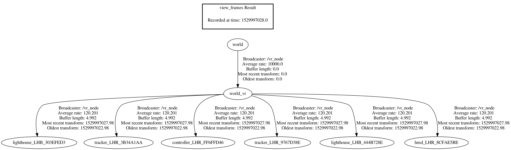
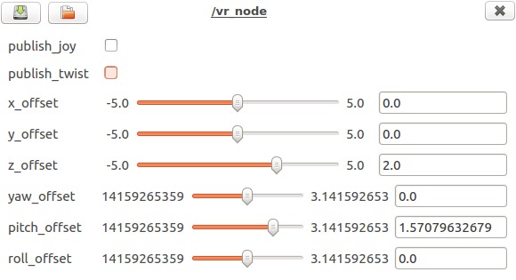
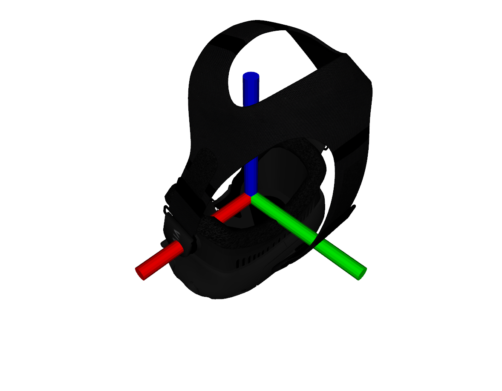
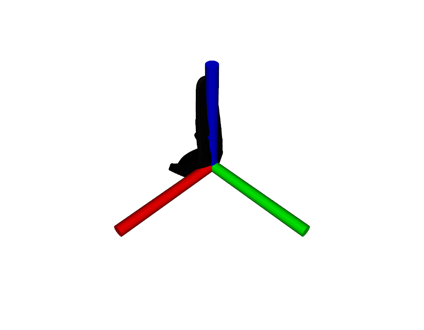
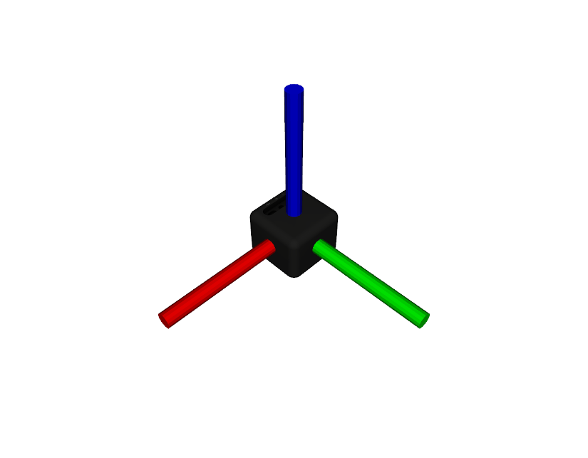
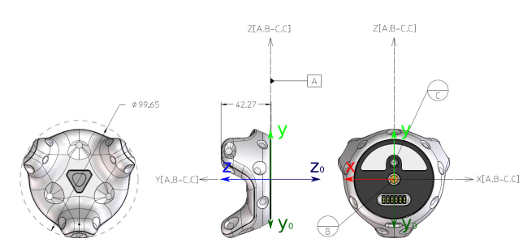

# Vive Bridge

Vive Bridge is a [Robotic Operating System (ROS)](http://www.ros.org/) package that utilises the [OpenVR SDK](https://github.com/ValveSoftware/openvr) by Valve, or alternatively [LibSurvive](https://github.com/cnlohr/libsurvive), to make VR devices such as the HTC Vive available in a ROS environment. The package is inspired by an existing [vive_ros](https://github.com/robosavvy/vive_ros) package by RoboSavvy, and it exposes a lot of the same functionality. The essentials of the [OpenVR SDK](https://github.com/ValveSoftware/openvr) is explained in great detail in the [OpenVR Quick Start](https://github.com/osudrl/CassieVrControls/wiki/OpenVR-Quick-Start) guide by Kevin Kellar.


## Features

The package supports the following types of devices:
* HMD (Head-Mounted Display)
* Controller
* Tracker
* Lighthouse

The package exposes the position and orientation (pose) of each device as coordinate frames relative to the *world_vr* frame in the tf tree, which is configurable relative to the *world* frame. The naming scheme of each coordinate frame follows the following structure: &lt;device type&gt;\_&lt;serial number&gt;, e.g. *controller_LHR_FF6FFD46*. 

The serial number is used both internally and externally (in the package) to uniquely identify tracked devices. This results in a structure similar to the tf tree example that is shown below:



The package can also publish the linear and angular velocities (twists) of tracked devices as a geometry_msgs/TwistStamped message on the */vive_node/twist/&lt;device type&gt;_&lt;serial number&gt;* topic, e.g. */vive_node/twist/controller_LHR_FF6FFD46*. 

Axes and buttons on controllers can also be published as a sensor_msgs/Joy message on the */vive_node/joy/&lt;device type&gt;_&lt;serial number&gt;* topic, e.g. */vive_node/joy/controller_LHR_FF6FFD46*. Joy messages are only published when the controllers are interacted with.


### Visualization

It is also possible to visualize the tracked devices by using a MarkerArray display in RViz. The mesh files are defined in the ```launch/vive_node.launch``` file as parameters for each type of device:
* hmd_mesh_path
* controller_mesh_path
* tracker_mesh_path
* lighthouse_mesh_path

*The mesh files has to be supported by RViz, i.e. .stl, .mesh (Ogre) or .dae (COLLADA).*

The tracked devices are then visualized by adding ```/vive_node/rviz_mesh_markers``` as *Marker Topic* in a MarkerArray display.

*The following warning message is normal when starting the node:*
```
[ WARN] [1552396105.439729800]: Topic '/vive_node/rviz_mesh_markers' unable to connect to any subscribers within 0.5 sec. It is possible initially published visual messages will be lost.
```
*It just indicates that no nodes received the mesh markers that are published when the vive node starts.*

## Requirements

### OpenVR SDK

The package requires the [OpenVR SDK](https://github.com/ValveSoftware/openvr), which has to be built from the newest available source. It is possible to download and build the source in the correct folder by utilising the following commands:
```
cd ~
mkdir lib
cd lib
git clone https://github.com/ValveSoftware/openvr.git
cd openvr
mkdir build
cd build
cmake -DCMAKE_BUILD_TYPE=Release ../
make
```

It is also possible to specify which folder the [OpenVR SDK](https://github.com/ValveSoftware/openvr) should be located in, by changing the *CMakeLists.txt* file in the package directory:
```
set(OPENVR "$ENV{HOME}/lib/openvr")
```

### LibSurvive

The package requires [LibSurvive](https://github.com/cnlohr/libsurvive), which is an open-source and reverse engineered driver, API and tools for the HTC VIVE. 

```
cd ~
mkdir lib
cd lib
git clone https://github.com/cnlohr/libsurvive.git
cd libsurvive
make
```

It is also possible to specify which folder [LibSurvive](https://github.com/cnlohr/libsurvive) should be located in, by changing the *CMakeLists.txt* file in the package directory:
```
set(OPENVR "$ENV{HOME}/lib/libsurvive")
```

You also have to install the udev rules that comes with [LibSurvive](https://github.com/cnlohr/libsurvive):

```
cd lib/libsurvive
sudo cp useful_files/81-vive.rules to /etc/udev/rules.d/
sudo udevadm control --reload-rules && udevadm trigger
```

### Steam and SteamVR

SteamVR is available through [Steam](https://store.steampowered.com/about/), which is utilised for configuration and room setup. It is also required for running this package by itself, as it depends on the *vrserver* process running in the background. This is a requirement because the OpenVR part of the package runs as a background application ([OpenVR API Documentation](https://github.com/ValveSoftware/openvr/wiki/API-Documentation)):

```VRApplication_Background``` - The application will not start SteamVR. If it is not already running the call with VR_Init will fail with VRInitError_Init_NoServerForBackgroundApp.

[Steam](https://store.steampowered.com/about/) is installed by following the *Getting Started* guide on their [Steam for Linux](https://github.com/ValveSoftware/steam-for-linux) tracker. SteamVR should be installed automatically by Steam if there is any VR devices present on your computer. It is also important to meet the **GRAPHICS DRIVER REQUIREMENTS** and the **USB DEVICE REQUIREMENTS** on their [SteamVR for Linux](https://github.com/ValveSoftware/SteamVR-for-Linux) tracker. A complete guide on getting the Vive up and running in SteamVR is available from: [HTC Vive Installation Guide](https://support.steampowered.com/steamvr/HTC_Vive/).


## Installation

The package is built by cloning this repository into your catkin workspace (catkin_ws/src directory) and then making it with ```catkin_make```


## Usage

The package is simply run by launching the following launch file:
```roslaunch vive_bridge vive_node.launch```

Alternatively, the package can be run with [LibSurvive](https://github.com/cnlohr/libsurvive) by launching the following launch file:
```roslaunch vive_bridge survive_node.launch```. The package should expose the same functionality with both back-ends. It is possible to send console commands to [LibSurvive](https://github.com/cnlohr/libsurvive) with the ```cmd``` argument, e.g. ```cmd:="help"```.

*You may have to change the directory paths for Steam and your Catkin workspace in the ```/scripts/launch.sh``` shell script depending on their location. The package assumes that the directories are in their defuault locations.*

```
STEAM_RUNTIME=$HOME/.steam/steam/ubuntu12_32/steam-runtime
CATKIN_WS=$HOME/catkin_ws
```

*Applications are generally run through the Steam runtime by running the ```run.sh``` script. The script is in the steam-runtime folder, and takes the application as an argument for the script.*
```~/.steam/steam/ubuntu12_32/steam-runtime/run.sh ~/catkin_ws/devel/lib/vive_bridge/vive_bridge_node```

### Interacting with the node

The *vive_node* publishes information about the currently tracked devices to the ```/vive_node/tracked_devices``` topic. This topic uses a custom ```vive_bridge/TrackedDeviceStamped.msg``` message that contains information about:
* frame_id - Fixed VR frame (within the message header)
* uint8 device_count - Number of tracked devices
* uint8[] device_classes - Classes of tracked devices (classes are defined within the message):
```uint8 INVALID=0
uint8 HMD=1
uint8 CONTROLLER=2
uint8 TRACKER=3
uint8 LIGHTHOUSE=4
```
* string[] device_frames - Child frames associated with each tracked device

The frame names within the ```device_frames``` field can then be used to find the joy and twist topics of each tracked device, e.g. the twist topic of the first tracked device could be:

```"/vive_node/twist/" + msg_.device_frames[0]```

It is also possible to request this information from the ```/vive_node/tracked_devices``` service, which requests a *std_msgs/Empty* message, and responds with the same format as the ```vive_bridge/TrackedDeviceStamped.msg```. The frame_id is however included as it's own field in the response, instead of being included in the message header.

### Controller axes and buttons

The package currently supports all inputs from the Vive controller, and the [sensor_msgs/Joy](http://docs.ros.org/melodic/api/sensor_msgs/html/msg/Joy.html) messages have the following format:
* axes[0] - Trackpad x
* axes[1] - Trackpad y
* axes[2] - Trigger
* buttons[0] - Menu
* buttons[1] - Grip
* buttons[2] - Trackpad
* buttons[3] - Trigger

The package also emulates a numpad when pressing different points on the trackpad button:
* buttons[ 4] - 1 Left down
* buttons[ 5] - 2 Center down
* buttons[ 6] - 3 Right down
* buttons[ 7] - 4 Left center
* buttons[ 8] - 5 Center
* buttons[ 9] - 6 Right center
* buttons[10] - 7 Left up
* buttons[11] - 8 Center up
* buttons[12] - 9 Right up

*The x and y values from touching the trackpad is used to find the corresponding numpad key. The header also contains the frame_id associated with the tracked device.*


## Configuration



The position and orientation (pose) of each device is defined relative to the *world_vr* frame, which has the same position as one of the lighthouses. This frame has to be defined relative to some defined *world* frame to make sense of the environment. The transformation between these frames are exposed as x-, y-, z- and roll-, pitch-, yaw- (RPY) offset parameters by the [dynamic_reconfigure](http://wiki.ros.org/dynamic_reconfigure) package. This package provides a standard way to change the offset parameters at any time without having to restart the node, and also provides a graphical user interface (GUI) to change these parameters by using [rqt_reconfigure](http://wiki.ros.org/rqt_reconfigure):

```rosrun rqt_reconfigure rqt_reconfigure```.

The parameters from [dynamic_reconfigure](http://wiki.ros.org/dynamic_reconfigure) are saved and loaded automatically from the ```/config/dynparam.yaml``` file.

### Coordinate frames





Tracked devices follows the following coordinate frames conventions:
* X-axis equates to pitch
* Y-axis is up and equates to yaw (except for the Vive Tracker, which has Z-axis down)
* Z-axis is opposite of approach direction and equates to roll



~~The Vive Tracker coordinate system is rotated 180&deg; around the x-axis such that the z-axis points upwards. This is because we want the tracker to match the orientation of our reference frame (world), when it is placed horizontally on the ground.~~

The original coordinate frame (x, y_0, z_0) of the Vive Tracker is used.


## Compatibility

The package was tested with:
* Vive with OpenVR SDK 1.4.18 and Ubuntu 16.04 LTS running ROS Kinetic Kame (1.12.13)


## To-do list