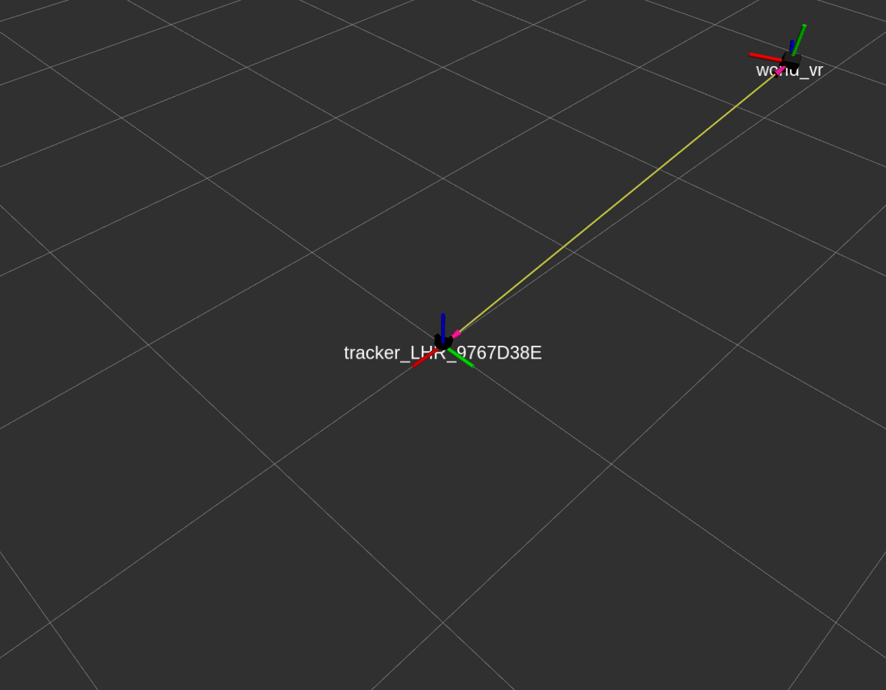

# vive_calibrating



From the configuration section of the *vive_bridge* README:
> The position and orientation (pose) of each device is defined relative to the *world_vr* frame, which has the same position as one of the lighthouses. This frame has to be defined relative to some defined *world* frame to make sense of the environment. The transformation between these frames are exposed as x-, y-, z- and roll-, pitch-, yaw- (RPY) offset parameters by the [dynamic_reconfigure](http://wiki.ros.org/dynamic_reconfigure) package.

vive_calibrating is a [Robotic Operating System (ROS)](http://www.ros.org/) package, and supplements the vive_bridge package by configuring the offset parameters that this package exposes, which effectively calibrates the package. These offset parameters are calculated by thinking of a *VIVE Tracker* frame as the new world frame. The new offset transformation is then simply the transformation between the *VIVE Tracker* frame and the *world_vr* frame, which every tracked device is defined relative to. This solution is intended as a coarse calibration of the offset parameters, and should (probably) be fine-tuned depending on the application.


## Installation

The package is built by cloning this repository into your catkin workspace (catkin_ws/src directory) and then making it with ```catkin_make```


## Usage

The package is simply run by running the following node:
```rosrun vive_calibrating vive_calibrating_node```

The package then waits for an available controller and tracker, and should automaticly detect and return these tracked devices, e.g.:
```Waiting for controller and tracker...
Using controller_LHR_FFC4DB41 and tracker_LHR_9767D38E for calibration
```

The offset parameters are then tuned automaticly by simply pressing the menu button on the controller, making the *VIVE Tracker* frame the new world frame.


## Compatibility

The package was tested with:
* HTC VIVE and Ubuntu 16.04 LTS running ROS Kinetic Kame (1.12.13)

## To-do list
* Implement a more robust calibration solution, e.g. calibrating with a robot